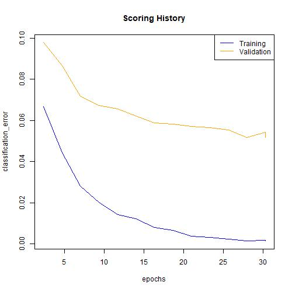
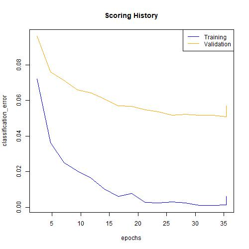
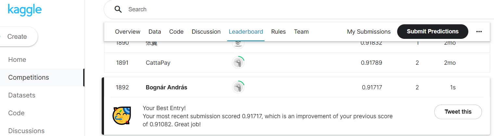

```{r setup, include=FALSE}
library(kableExtra)
library(tidyverse)
library(data.table)
library(english)
library(h2o)
library(keras)
h2o.init()
```
```{r setup II, include=FALSE, eval=TRUE, out.width="65%"}
knitr::opts_chunk$set(echo = TRUE, warning = FALSE, message = FALSE)
```

## 1. - MNIST  Digits

### A, Evaluation Metric

A technical note: some files and pictures are loaded in from local save, they are uploaded to [this Github repo](https://github.com/BognarAndras/ds2-assignments).

Since in this case we don't have any preference about the errors of classes (an error for classifying any number weights the same), the natural choice seems to be mean per class error.

```{r data load}
# Load data

mnist_train <- read_csv("train.csv")
mnist_holdout <- read_csv("test.csv")

# Normalize/scale down pixel values to 0-1

mnist_train <- mutate(mnist_train,
                      label = as.factor(label),
                      across(-label, ~./255)
)


mnist_holdout <- mutate(mnist_holdout,
                      across(everything(), ~./255)
)


```


### B, Data and images

I choose to download the train-holdout data from Kaggle and show below the first 12 train images with their labels.

```{r sample pictures}
# Get number names as words

labels <- as.integer(data.table(mnist_train)[1:12 , label ]) -1 
labels <- as.english(labels)

# Functions for ggplots

xy_axis <- as_tibble(expand.grid(x = 1:28, y = 28:1))
plot_theme <- list(
  raster = geom_raster(hjust = 0, vjust = 0),
  gradient_fill = scale_fill_gradient(low = "white", high = "black", guide = "none"),
  theme = theme(
    axis.line = element_blank(),
    axis.text = element_blank(),
    axis.ticks = element_blank(),
    axis.title = element_blank(),
    panel.background = element_blank(),
    panel.border = element_blank(),
    panel.grid.major = element_blank(),
    panel.grid.minor = element_blank(),
    plot.background = element_blank()
  )
)

showImages <- function(data, row_indices) {
  list_of_plots <- map(row_indices, ~{
    cbind(xy_axis, fill = t(data[.x, -1])) |>
      ggplot(aes(x, y, fill = fill)) +
      coord_fixed() +
      plot_theme 
  })
  for (num in 1:12) {
    list_of_plots[[num]] <- list_of_plots[[num]] + labs(title = labels[num])
  }
  
  do.call(gridExtra::grid.arrange, list_of_plots)
}
# Run for first 12 numbers

showImages(mnist_train, 1:12)
```


### C, Fully trained model

Before running a model I split the train-test data.

```{r train test,results='hide'}
# Set holdout sample to h2o object
mnist_holdout <- as.h2o(mnist_holdout)
# Make train-test split. Seed is reproducible here but not for later h2o models.

my_seed <-20220406

data_split <- h2o.splitFrame(as.h2o(mnist_train), ratios = 0.1, seed = my_seed)
mnist_training <- data_split[[1]]
mnist_test <- data_split[[2]]
```

Then create some benchmarks: by random chance we would be wrong 90% of the time for each number. Logistic model will also serve as good baseline.

```{r benchmark,results='hide'}
# Set holdout sample to h2o object
mnist_logit <- h2o.glm(
  x = 2:785,
  y = "label",
  training_frame = mnist_training,
  validation_frame = mnist_test,
  model_id = "logit_benchmark",
  lambda = 0,
  seed = my_seed
)

logit_mean_class_err <-  h2o.mean_per_class_error(mnist_logit, train = TRUE, valid = TRUE)


```

```{r results benchmark}
results <- tibble(
  model = "Random Choice Expectation",
  mean_class_train = 0.9,
  mean_class_test = 0.9
)

results <- add_row(results,
                         model =  "Logit Benchmark",
                         mean_class_train = round(logit_mean_class_err[1],4),
                         mean_class_test = round(logit_mean_class_err[2],4) 
)

```

```{r fully connected network,results='hide'}
mnist_dl_default <- h2o.deeplearning(
  x = 2:785,
  y = "label",
  training_frame = mnist_training,
  validation_frame = mnist_test,
  model_id = "mnist_dl_default",
  hidden = 200,
  score_each_iteration = TRUE,
  seed = my_seed
)

full_class_err <-  h2o.mean_per_class_error(mnist_dl_default, train = TRUE, valid = TRUE)
```

As you can see below the full model is very prone to overfit. In fact it produces close perfect train results. It's still better than the benchmarks, but let's try to improve this issue.

```{r fully connected plot}
plot(mnist_dl_default, metric = "classification_error")
```

```{r results full}

results <- add_row(results,
                         model =  "Fully connected Network",
                         mean_class_train = round(full_class_err[1],4),
                         mean_class_test = round(full_class_err[2],4) 
)

results
```


### D, Testing parameters

Below is the code I used for testing 5 different models, in the interest of saving time I saved out their results to file which I present below.

First, I wanted to see if more complex networks would produce better results, starting with a very big first layer.

```{r large network,results='hide', eval=FALSE}
mnist_dl_large <- h2o.deeplearning(
  x = 2:785,
  y = "label",
  training_frame = mnist_training,
  validation_frame = mnist_test,
  model_id = "mnist_dl_large",
  hidden = 500,
  score_each_iteration = TRUE,
  seed = my_seed  
)

large_class_err <-  h2o.mean_per_class_error(mnist_dl_large, train = TRUE, valid = TRUE)
```


```{r results large, eval=FALSE}

results <- add_row(results,
                         model =  "Large Network",
                         mean_class_train = round(large_class_err[1],4),
                         mean_class_test = round(large_class_err[2],4) 
)


```

It seemed to produce improvements, however, I then compared it two smaller but still big layers and they outperformed it. 


```{r layers,results='hide', eval=FALSE}
mnist_dl_layers <- h2o.deeplearning(
  x = 2:785,
  y = "label",
  training_frame = mnist_training,
  validation_frame = mnist_test,
  model_id = "mnist_dl_layers",
  hidden = c(300,300),
  score_each_iteration = TRUE,
  seed = my_seed  
)

layers_class_err <-  h2o.mean_per_class_error(mnist_dl_layers, train = TRUE, valid = TRUE)
```


```{r results layers,eval=FALSE}

results <- add_row(results,
                         model =  "Layers Network",
                         mean_class_train = round(layers_class_err[1],4),
                         mean_class_test = round(layers_class_err[2],4) 
)


```


So complexity produces some improvements, but instead we should probably focus on the bigger issue of overfitting by trying regularization techniques.

First, I increased the ration of randomly dropped nodes from the hidden layer. 


```{r drop,results='hide',eval=FALSE}
mnist_dl_drophidden <- h2o.deeplearning(
  x = 2:785,
  y = "label",
  training_frame = mnist_training,
  validation_frame = mnist_test,
  model_id = "mnist_dl_drophidden",
  hidden = c(300,300),
  activation = "RectifierWithDropout",
  hidden_dropout_ratios = c(0.2, 0.2),
  score_each_iteration = TRUE,
  seed = my_seed  
)

drop_class_err <-  h2o.mean_per_class_error(mnist_dl_drophidden, train = TRUE, valid = TRUE)
```


```{r drop full,eval=FALSE}

results <- add_row(results,
                         model =  "Hidden Drop Network",
                         mean_class_train = round(drop_class_err[1],4), 
                         mean_class_test = round(drop_class_err[2],4) 
)


```


Then dropping input nodes. Surprisingly, randomly dropping half the input nodes produced a relatively big improvement.

```{r input drop,results='hide',eval=FALSE}
mnist_dl_dropinput <- h2o.deeplearning(
  x = 2:785,
  y = "label",
  training_frame = mnist_training,
  validation_frame = mnist_test,
  model_id = "mnist_dl_dropinput",
  hidden = c(300,300),
  activation = "RectifierWithDropout",
  hidden_dropout_ratios = c(0.2, 0.2),
  epochs = 30,
  input_dropout_ratio = 0.5,
  score_each_iteration = TRUE,
  seed = my_seed  
)

drop_input_class_err <-  h2o.mean_per_class_error(mnist_dl_dropinput, 
                                                  train = TRUE, valid = TRUE)
```
```{r input drop plot, eval=FALSE}


jpeg("dropinput_plot.jpg", width = 500, height = 500)
plot(mnist_dl_dropinput, metric = "classification_error")
dev.off()
```

In fact, you can see that this was the first model where I had to increase the size of epochs as the improvements didn't stop in the first 10 epochs.

```{r dropinput plot, out.width="65%"}

```

```{r input drop full, eval=FALSE}

results <- add_row(results,
                         model =  "Input Drop Network",
                         mean_class_train = round(drop_input_class_err[1],4), 
                         mean_class_test = round(drop_input_class_err[2],4) 
)


```

So regularization seems to work as intended, but maybe I haven't run the models for long enough to catch some hidden patterns, so I changed to a more lenient stopping rule forcing the algorithm to run for longer.

```{r run longer,results='hide',eval=FALSE}
mnist_dl_longer <- h2o.deeplearning(
  x = 2:785,
  y = "label",
  training_frame = mnist_training,
  validation_frame = mnist_test,
  model_id = "mnist_dl_longer",
  hidden = c(300,300),
  mini_batch_size = 20,
  activation = "RectifierWithDropout",
  hidden_dropout_ratios = c(0.2, 0.2),
  epochs = 100,
  input_dropout_ratio = 0.5,
  stopping_tolerance = 0.0005,
  score_each_iteration = TRUE,
  seed = my_seed  
)

longer_class_err <-  h2o.mean_per_class_error(mnist_dl_longer, 
                                                  train = TRUE, valid = TRUE)
```
```{r longer plot save, eval=FALSE}


jpeg("longer_plot.jpg", width = 500, height = 500)
plot(mnist_dl_longer, metric = "classification_error")
dev.off()
```

However, this didn't work. So in conclusion if I had more time, it seems I should have done even more regularisation.

```{r longer plot, out.width="65%"}

```

```{r lenient results, eval=FALSE}

results <- add_row(results,
                         model =  "Lenient stop rule",
                         mean_class_train = round(longer_class_err[1],4), 
                         mean_class_test = round(longer_class_err[2],4) 
)


```


### E, Validation

I choose as my preferred model, the most regularized *Input Drop Network* one and used it on Kaggle to test it's performance on the holdout set where we have no labels.

```{r save out results, eval=FALSE}
# Remove benchmark and full networks as I will run these in the notebook
 
results <- results |> filter(!model %in% c("Random Choice Expectation" , "Logit Benchmark",
                                           "Fully connected Network" )

# save out the results of the 5 tested models

saveRDS(results, file = "model_results.rds")

```
```{r load in model results}
# Load in model results, join them to basic models 
model_results <- readRDS(file = "model_results.rds")

results <- rbind(results , model_results)

kable(format(as.data.frame(results),nsmall = 0),  
       align=rep('c', 3) ) |> kable_styling(latex_options = "hold_position"
                                                           , font_size = 11 )
```


```{r test,results='hide',eval=FALSE}
predictions <- as.data.frame(h2o.predict(object = mnist_dl_dropinput, newdata = mnist_holdout))


df_predictions <- data.frame(seq_along(1:nrow(predictions)) , predictions["predict"]) |> 
        rename( "ImageId"=seq_along.1.nrow.predictions..,
                "Label"=predict )
write.csv(df_predictions,"submission.csv", row.names = FALSE)
```

The result is worse then in the test set which isn't that big of a surprise as mentioned the model still heavily overfits. Al tough, one big improvement could be to use both the test and train data for further training, some of the test pictures do seem relatively different from the training ones.

```{r kaggle, out.width="85%"}

```

\newpage

## 2. - Hot dog or not

### A, Images

A hot dog and a pizza. I'm vegan so not very appetizing.

```{r hot dog pictures, out.width="65%"}

knitr::include_graphics("ceu-ml/data/hot-dog-not-hot-dog/train/hot_dog/869853.jpg")

knitr::include_graphics("ceu-ml/data/hot-dog-not-hot-dog/train/not_hot_dog/98617.jpg")
```


### B, Evaluation metric

For 2 classes accuracy seems to be more intuitive. Although, it's not entirely clear what the app's goal is. Perhaps we only care about hot-dogs so sensitivity or true positive rate could be more useful. I choose accuracy here.

### C, Data loading

Following the instructions the generators worked well.

```{r hot dog train,results='hide'}


train_generator <- keras::flow_images_from_directory(
    directory = "ceu-ml/data/hot-dog-not-hot-dog/train/",
    generator = image_data_generator(rescale = 1/255),
    target_size = c(128, 128),
    class_mode = "binary"
)

valid_generator <- keras::flow_images_from_directory(
    directory = "ceu-ml/data/hot-dog-not-hot-dog/test/",
    generator = image_data_generator(rescale = 1/255),
    target_size = c(128, 128),
    class_mode = "binary"
)
```

### D, Simple model

To build the model 3 color dimensions were included and classification is binary.

```{r simple cnn model,results='hide'}
cnn_model_w_augmentation <- keras_model_sequential()
cnn_model_w_augmentation |> 
    layer_conv_2d(
        filters = 32,
        kernel_size = c(3, 3),
        activation = 'relu',
        input_shape = c(128, 128, 3)
    ) |> 
    layer_max_pooling_2d(pool_size = c(2, 2)) |> 
    layer_dropout(rate = 0.2) |> 
    layer_flatten() |> 
    layer_dense(units = 32, activation = 'relu') |> 
    layer_dense(units = 1, activation = 'softmax')

compile(
    cnn_model_w_augmentation,
    loss = 'binary_crossentropy',
    optimizer = optimizer_rmsprop(),
    metrics = c('accuracy')
)

fit(cnn_model_w_augmentation,
    train_generator,
    epochs = 30,
    batch_size = 32,
    validation_data = valid_generator,
    validation_steps=length(valid_generator$labels)/32,
    steps_per_epoch=length(train_generator$labels)/32
)
```
Accuracy seems to be slightly below 50%. This is about as good as coin flip. Let's see if augmentation via photo modifications can help.

```{r simple cnn accur}
performance_simple_cnn <- evaluate(cnn_model_w_augmentation , valid_generator,
                                   steps = valid_generator$n/32)

performance_simple_cnn[2]
```
### E, Augmented model

I tried all source of imagine changing options.

```{r data-augmentation,results='hide'}


extra_train_datagen <- image_data_generator(
    rescale = 1/255,
    rotation_range = 20,
    width_shift_range = 0.1,
    height_shift_range = 0.1,
    shear_range = 0.1,
    zoom_range = 0.1
)


train_generator_augment <- keras::flow_images_from_directory(
    directory = "ceu-ml/data/hot-dog-not-hot-dog/train/",
    # generator = image_data_generator(rescale = 1/255),
    generator = extra_train_datagen,
    target_size = c(128, 128),
    class_mode = "binary"
)

valid_generator_augment <- keras::flow_images_from_directory(
    directory = "ceu-ml/data/hot-dog-not-hot-dog/test/",
    generator = image_data_generator(rescale = 1/255),
    target_size = c(128, 128),
    class_mode = "binary",
)
```

Combined they produce a slight improvement but not much. Seems like a bit too much work for these results, probably needs more tuning. Of course, this is a lot harder task then the first since a hot dog can evidently be lot less defined than a number.

```{r augmented model run,results='hide'}
cnn_model_w_augmentation_2 <- keras_model_sequential()
cnn_model_w_augmentation_2 |> 
    layer_conv_2d(
        filters = 32,
        kernel_size = c(3, 3),
        activation = 'relu',
        input_shape = c(128, 128, 3)
    ) |> 
    layer_max_pooling_2d(pool_size = c(2, 2)) |> 
    layer_dropout(rate = 0.2) |> 
    layer_flatten() |> 
    layer_dense(units = 32, activation = 'relu') |> 
    layer_dense(units = 1, activation = 'softmax')

compile(
    cnn_model_w_augmentation_2,
    loss = 'binary_crossentropy',
    optimizer = optimizer_rmsprop(),
    metrics = c('accuracy')
)

fit(cnn_model_w_augmentation_2,
    train_generator_augment,
    epochs = 30,
    batch_size = 32,
    validation_data = valid_generator_augment,
    validation_steps=length(valid_generator_augment$labels)/32,
    steps_per_epoch=length(train_generator_augment$labels)/32
)
```

```{r augmented model accuracy}
performance_aug_cnn <- evaluate(cnn_model_w_augmentation_2 , valid_generator, 
                                steps = valid_generator$n/32)

performance_aug_cnn[2]
```